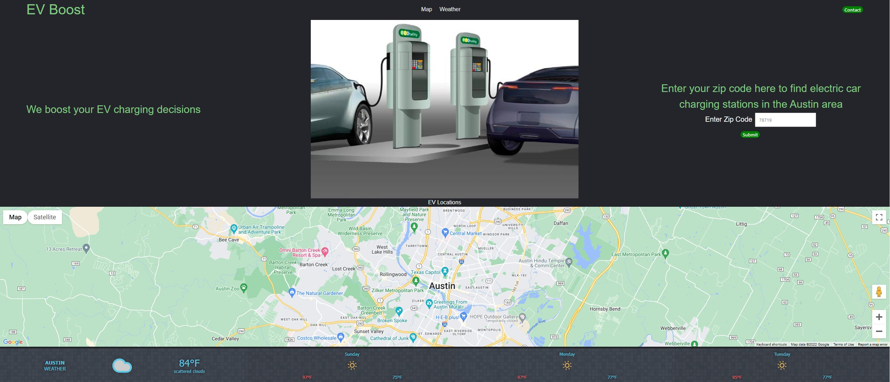

# EV-Boost
 
## EV-Boost Webpage
 
EV Boost allows users to search for Electric Vehicle chargers based on zip codes in the Austin area. Users will enter a zipcode in the Austin area and then will be able to view all charging stations within that specific postal code. The technologies used inside the webpage included 3 server APIs (Google, Weather, and OpenCharge), incorporated Bulma CSS, JS, HTML, and finally Github.

## Usage
This is to allows users of the webpage to view charging stations within their local zipcode through a simple search. 

## Elevator Pitch

With the growing number of electric vehicles on the road, finding a 
charging station becomes increasingly important.
That’s where EV-Boost comes in to play. Simply pull up EVBoost.com 
on your favorite browser, enter your zip code and using Google Maps 
technology, get all the charging stations in the area. As a bonus, you 
can even get the weather forecast. EV-Boost helping you charge into 
your day!
 
## Demo
https://michael-alvarado.github.io/EV-Boost/

## License
 
MIT License
 
Copyright (c) [2022] [Darrelwu]
Permission is hereby granted, free of charge, to any person obtaining a copy of this software and associated documentation files (the "Software"), to deal in the Software without restriction, including without limitation the rights to use, copy, modify, merge, publish, distribute, sublicense, and/or sell copies of the Software, and to permit persons to whom the Software is furnished to do so, subject to the following conditions:
The above copyright notice and this permission notice shall be included in all copies or substantial portions of the Software.
THE SOFTWARE IS PROVIDED "AS IS", WITHOUT WARRANTY OF ANY KIND, EXPRESS OR IMPLIED, INCLUDING BUT NOT LIMITED TO THE WARRANTIES OF MERCHANTABILITY, FITNESS FOR A PARTICULAR PURPOSE AND NONINFRINGEMENT. IN NO EVENT SHALL THE AUTHORS OR COPYRIGHT HOLDERS BE LIABLE FOR ANY CLAIM, DAMAGES OR OTHER LIABILITY, WHETHER IN AN ACTION OF CONTRACT, TORT OR OTHERWISE, ARISING FROM, OUT OF OR IN CONNECTION WITH THE SOFTWARE OR THE USE OR OTHER DEALINGS IN THE SOFTWARE.
